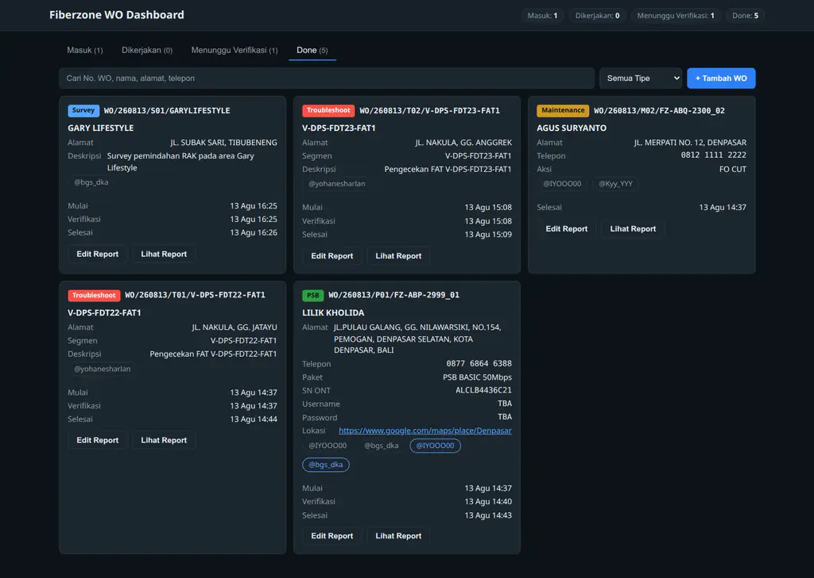

<div align="center">

# 🌐 Fiberzone WO Dashboard

**Work Order Management System for Fiber Optic Internet Service Providers**

Tracks field technician work orders from **Masuk (Incoming)** → **Dikerjakan (In Progress)** → **Menunggu Verifikasi (Pending Verification)** → **Done** — with smart report parsing straight from chat messages.


</div>

---

## ✨ Features

| | |
|---|---|
| 🗂️ **4-status pipeline** | Masuk → Dikerjakan → Menunggu Verifikasi → Done, with timestamps (`started_at`, `verification_at`, `done_at`) and strict forward-only transitions |
| 📋 **6 work order formats** | Maintenance (M), PSB / New Install (P), Troubleshoot (T), Dismantle (D), Network Build (B), Survey (S) — auto-parsed from raw chat text |
| 🤖 **Tolerant report parser** | Paste a technician's report from WhatsApp/Telegram → parsed into structured fields (case, action, solution, tools installed, splitter, splicer, SN ONT, …). Invisible characters (U+200E/U+200F/U+200B/U+FEFF) auto-stripped |
| 📥 **Paste = Done** | Matching a report to its `WO/...` code resolves the WO instantly — exactly how field teams work |
| 🛡️ **Verification gate** | A WO cannot be marked **Done** without a report (enforced server-side, 422) |
| 🔍 **Search & filter** | Live search across WO codes, customers, addresses + type filter + status tabs with live counts |
| 🖥️ **Zero-dependency frontend** | Vanilla HTML/CSS/JS — no build step, no npm, dark theme, responsive down to 360 px |
| 🖥️ **CLI included** | `python -m app.cli add|move|list|report` for quick ops from the terminal |
| 🧪 **Tested** | 31 tests: parser edge cases, API contract, performance (120+ WO) |

## 🖼️ Dashboard



## 🚀 Quick Start

```bash
# 1. Clone & install (Python 3.12+, use a venv — system Python may be PEP-668 locked)
git clone https://github.com/Swanster/fiberzone-wo.git
cd fiberzone-wo
python3 -m venv .venv
.venv/bin/pip install -r requirements.txt

# 2. Run the backend (serves API + dashboard on port 8600)
.venv/bin/uvicorn app.main:app --host 127.0.0.1 --port 8600

# 3. Open the dashboard
xdg-open http://127.0.0.1:8600/
```

The SQLite database is created automatically on first start (`data/wo.db`). Override with the `FZWO_DB` env var (CI does this):

```bash
FZWO_DB=/path/to/custom.db .venv/bin/uvicorn app.main:app --port 8600
```

## 🧑‍💻 CLI

| Command | Description |
|---|---|
| `.venv/bin/python -m app.cli add <file.txt>` | Add a WO (or match a report → auto Done). Reads stdin when no file given |
| `.venv/bin/python -m app.cli move <wo_code> <status>` | Transition status (validates the same rules as the API) |
| `.venv/bin/python -m app.cli list [--status] [--type]` | List WOs with optional filters |
| `.venv/bin/python -m app.cli report <wo_code>` | Show the stored report of a WO |

## 🔌 API

Base URL: `http://127.0.0.1:8600/api` — errors use `{"detail": "..."}`, fields are `snake_case`.

| Method | Endpoint | Description |
|---|---|---|
| `GET` | `/api/health` | Liveness + DB check → `{"status":"ok","db":true}` |
| `GET` | `/api/wo?status=&type=&q=&limit=` | List / filter / search → `{"items":[...],"total":N}` |
| `GET` | `/api/wo/{id}` | WO detail (includes `report` + `report_raw`) |
| `POST` | `/api/wo/raw` | Parse raw text: WO → insert; report → match by `wo_code` → update + **auto Done** |
| `POST` | `/api/wo/{id}/status` | `{"status":"dikerjakan"}` — forward-only; **Done without report → 422** |
| `PUT` | `/api/wo/{id}/report` | `{"report":{...},"report_raw":"..."}` — `status_report` required, status unchanged |
| `DELETE` | `/api/wo/{id}` | Delete a WO |

### Work order format

```
WO/YYMMDD/TYPESEQ/IDENTITY
Customer Name
Address
Phone

Package / action lines
@assignee_username

Infra: @engineer1 @engineer2
Sharelocation: https://maps…
```

### Report format (paste from chat)

```
Report Maintenance

WO/260813/M02/FZ-ABQ-2300_02

Case :
- Kabel putus di tiang

Action :
- Sambung ulang kabel

Solution :
- Normal kembali

Status : Cleared
```

Unknown key-value pairs are preserved in `report.extra` during parsing and dropped on save — nothing crashes, nothing silently corrupts.

## 🗂️ Project Structure

```
fiberzone-wo/
├── app/
│   ├── main.py          # FastAPI app, static mount, /api/health
│   ├── db.py            # SQLite (WAL), schema per PRD §9.5, CRUD + search
│   ├── parser.py        # 6 WO formats + tolerant report parser
│   ├── cli.py           # add / move / list / report
│   ├── api/
│   │   └── wo.py        # /api/wo router (contract-first, frontend-defined)
│   └── static/          # index.html · style.css · app.js (vanilla, no build)
├── tests/               # parser, API contract, performance (31 tests)
├── docs/                # PRD, specs, plans, screenshots
├── .github/workflows/ci.yml
├── requirements.txt
└── .env.example
```

## 🧪 Testing

```bash
.venv/bin/python -m pytest tests/ -q     # 31 passed
```

CI runs the suite against a throwaway SQLite file on every push (`.github/workflows/ci.yml`).

## 🛣️ Roadmap

| Phase | Scope | Status |
|---|---|---|
| Phase 0 | Foundation: repo, env, CI/CD | ✅ 100% |
| Phase 1 | Parser engine, API layer | ✅ 100% |
| Phase 2 | Frontend dashboard, CLI, integration | ✅ 100% |
| Phase 3 | Validation: 31/31 tests + live E2E | ✅ 100% |

Full traceability: [`BACKLOG.md`](BACKLOG.md) (37/37 tasks), [`ROADMAP.md`](ROADMAP.md), [`DEVLOG.md`](DEVLOG.md), [`PRD.md`](PRD.md).

## 🤝 Contributing

1. Fork the repo
2. Create a feature branch
3. Commit changes (keep `BACKLOG.md` / `ROADMAP.md` / `DEVLOG.md` in sync — it's the project's rule)
4. Open a pull request — CI runs the full test suite

## 📄 License

[MIT](LICENSE) © 2026 Swanster
